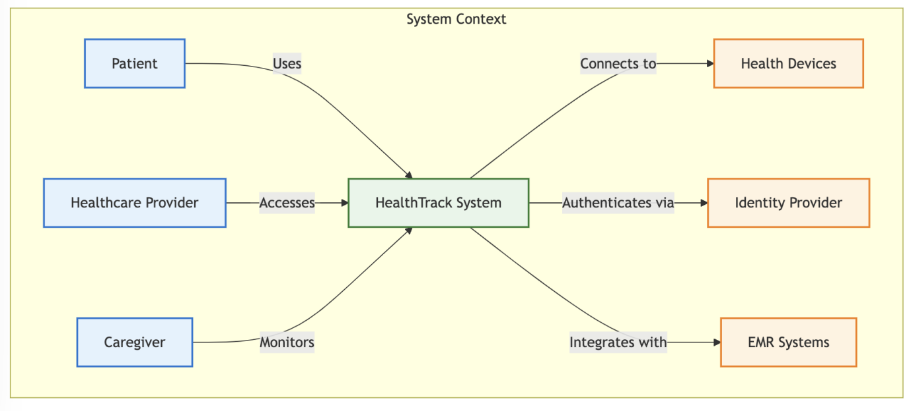
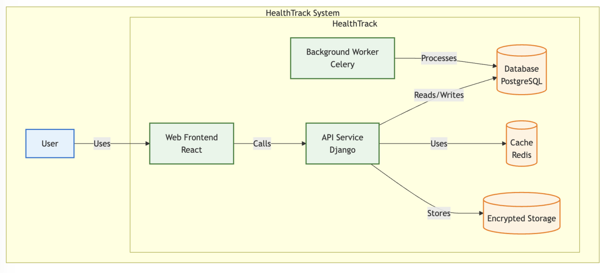
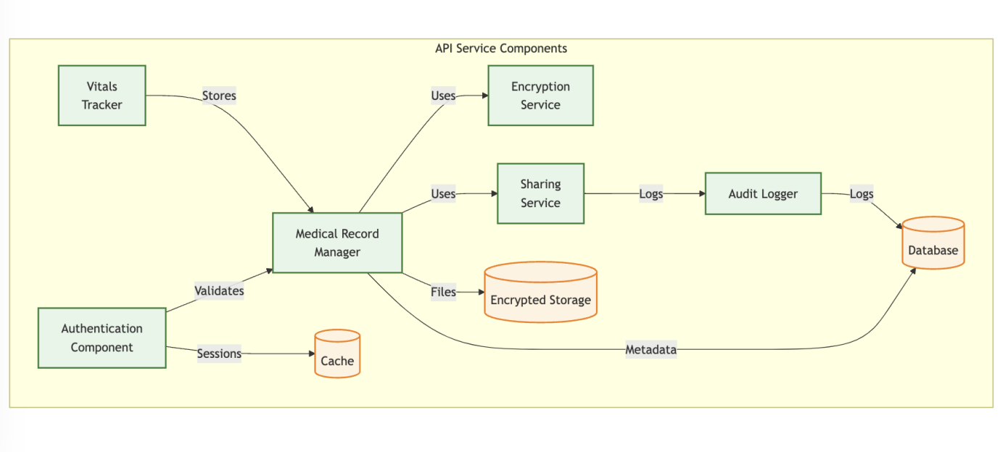
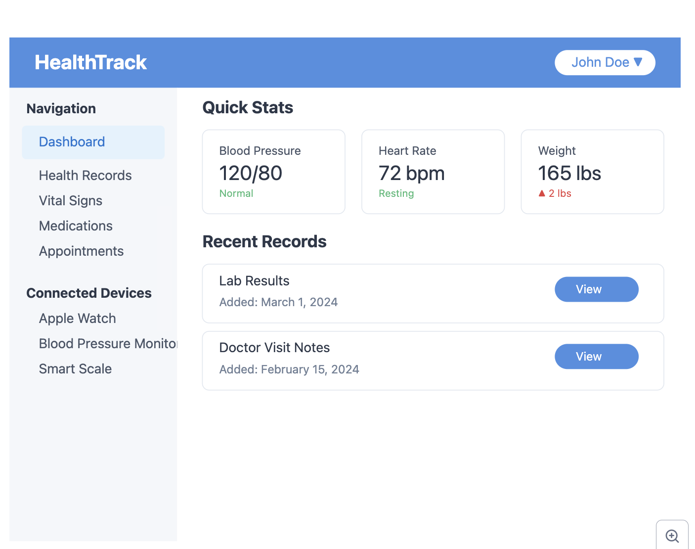
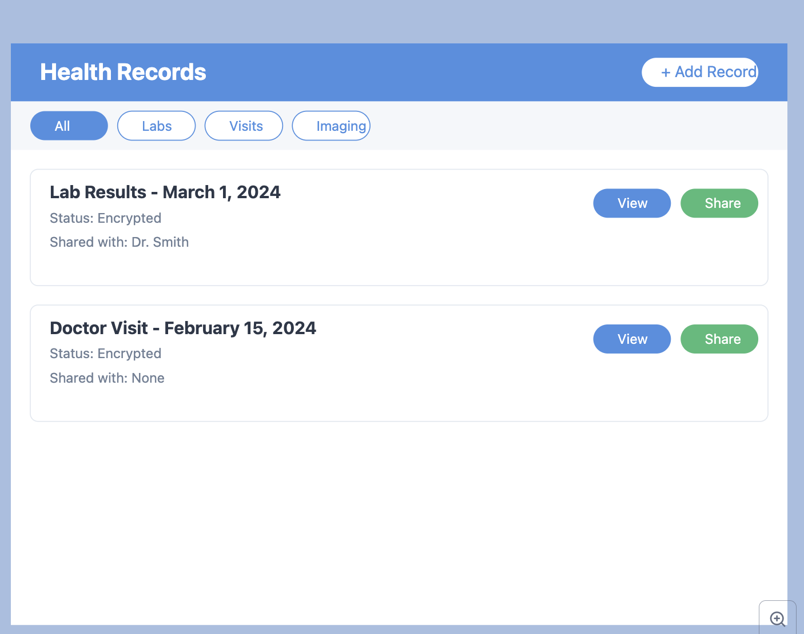
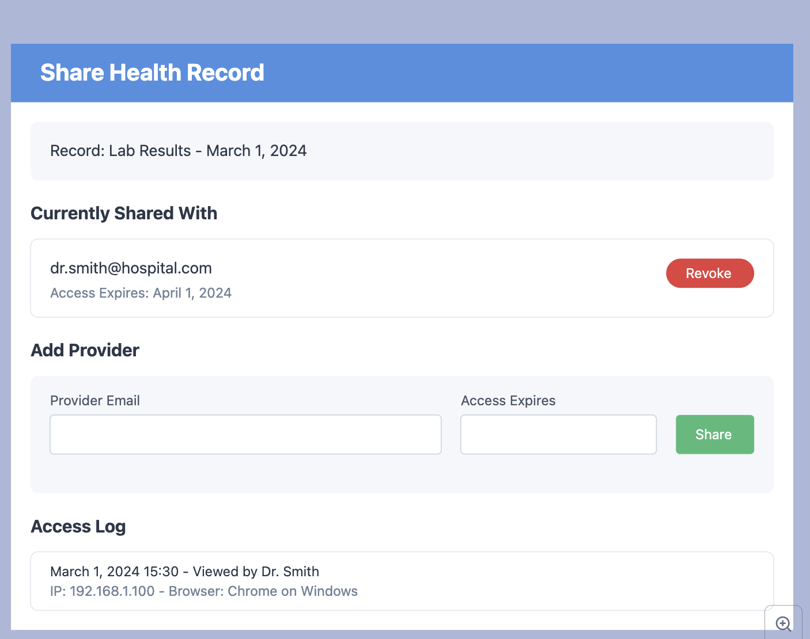

**HealthTrack**

**Executive Summary**

HealthTrack is a comprehensive personal health monitoring and medical record management system designed to help individuals take control of their health data while ensuring maximum security and privacy. The platform enables users to securely store medical records, track vital signs, manage medications, and share specific health information with healthcare providers.

What sets HealthTrack apart is its focus on security and privacy while maintaining ease of use. The platform implements end-to-end encryption, granular access controls, and detailed audit logging to protect sensitive health information. Whether tracking daily vitals, managing chronic conditions, or sharing records with new healthcare providers, HealthTrack ensures your health data remains private and secure.

**Installation**

bash

Copy

_\# Clone the repository_

git clone <https://github.com/yourusername/healthtrack.git>

_\# Navigate to project directory_

cd healthtrack

_\# Copy environment file_

cp .env.example .env

_\# Build Docker containers_

docker-compose build

_\# Start services_

docker-compose up -d

_\# Run migrations_

docker-compose exec web python manage.py migrate

_\# Create admin account_

docker-compose exec web python manage.py createsuperuser

**Getting Started**

1. Access the web interface at <http://localhost:8000>
2. Create your personal account
3. Set up your health profile
4. Connect health monitoring devices
5. Add your medical records
6. Configure provider access

**User Stories**

**Core User Stories**

1. As a **patient**, I want to **securely store my medical records** so I can **access them whenever needed and share them with healthcare providers**.
    - Acceptance Criteria:
        - End-to-end encryption of medical records
        - Support for various document formats (PDF, images, etc.)
        - Easy document categorization
        - Quick search functionality
        - Share specific records with providers
2. As a **health-conscious individual**, I want to **track my daily vital signs** so I can **monitor my health trends and spot potential issues**.
    - Acceptance Criteria:
        - Integration with health monitoring devices
        - Customizable vital sign tracking
        - Trend visualization
        - Configurable alerts
        - Export capabilities
3. As a **healthcare provider**, I want to **access shared patient records** so I can **provide better-informed care**.
    - Acceptance Criteria:
        - Secure access to shared records
        - Time-limited access controls
        - View patient health trends
        - Download authorized records
        - Receive updates for shared data
4. As a **caregiver**, I want to **monitor family member's health data** so I can **help manage their healthcare**.
    - Acceptance Criteria:
        - Delegated access controls
        - Customizable alerts
        - Medication reminders
        - Health event logging
        - Communication with providers

**Mis-user Stories**

1. As a **malicious actor**, I want to **access unauthorized health records** so I can **steal sensitive medical information**.
    - Mitigation Criteria:
        - Strong authentication requirements
        - End-to-end encryption
        - Access logging and monitoring
        - Anomaly detection
        - Regular security audits
2. As a **compromised provider account**, I want to **access more records than authorized** so I can **collect patient data**.
    - Mitigation Criteria:
        - Granular permission controls
        - Time-limited access
        - Access attempt monitoring
        - Automated suspicious behavior detection
        - Regular access reviews
3. As a **data broker**, I want to **aggregate health data** so I can **sell it to third parties**.
    - Mitigation Criteria:
        - Rate limiting on API endpoints
        - Usage pattern monitoring
        - Data watermarking
        - Export restrictions
        - Automated bulk access detection

**2\. Architecture Documentation**

**2.1 Context Diagram**

**2.2 Container Diagram**   

**2.3 Component Diagram**

**2.4 Dashboard View**

**2.5 Health Record View**

**2.6 Sharing Control Panel**

